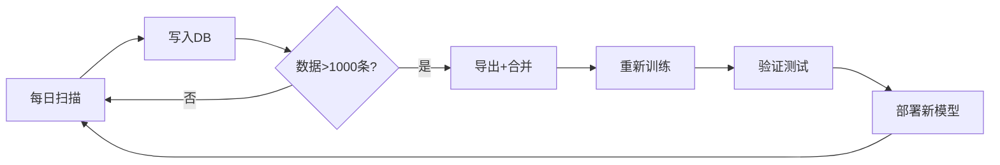

# ButterQuant ML 运维手册 / MLOps Maintenance Guide

> **版本 / Version**: 2.0  
> **更新日期 / Updated**: 2026-01-18

---

## 📋 目录 / Table of Contents

1. [快速开始 - 首次运行](#1-快速开始---首次运行)
2. [数据流架构](#2-数据流架构)
3. [日常运维](#3-日常运维)
4. [模型迭代](#4-模型迭代)
5. [故障排除](#5-故障排除)

---

## 1. 快速开始 - 首次运行

### 1.1 环境准备
```bash
# 安装依赖
pip install torch pandas numpy yfinance scikit-learn onnxruntime joblib

# 可选: GPU加速
pip install onnxruntime-gpu
```

### 1.2 首次训练流程
```bash
# Step 1: 生成历史模拟数据 (2-3小时)
python ml/generate_simulated_data.py

# Step 2: 验证数据质量
python ml/validate_data.py

# Step 3: 训练模型 (~3分钟)
python ml/train_model.py

# Step 4: 端到端测试
python ml/end_to_end_test.py

# Step 5: 验证推理引擎
python -c "from backend.ml_inference import ml_engine; print(ml_engine.get_model_version())"
```

---

## 2. 数据流架构

```
┌─────────────────────────────────────────────────────────────────┐
│                      数据流架构 / Data Flow                      │
└─────────────────────────────────────────────────────────────────┘

                    ┌──────────────────┐
                    │ 历史模拟数据      │ ← 首次训练 (一次性)
                    │ generate_simulated│
                    │ _data.py         │
                    └────────┬─────────┘
                             ↓
┌──────────────┐    ┌──────────────────┐    ┌──────────────────┐
│ daily_scanner│───→│ market_research  │───→│ training_data    │
│ .py          │    │ .db              │    │ _deep.parquet    │
│ (每日运行)   │    │ (持续写入)        │    │ (合并数据)        │
└──────────────┘    └──────────────────┘    └────────┬─────────┘
                                                      ↓
                                            ┌──────────────────┐
                                            │ train_model.py   │
                                            │ (定期重训)        │
                                            └────────┬─────────┘
                                                      ↓
                                            ┌──────────────────┐
                                            │ success_model    │
                                            │ _v2.onnx         │
                                            └────────┬─────────┘
                                                      ↓
                                            ┌──────────────────┐
                                            │ execution_engine │
                                            │ .py (实时推理)    │
                                            └──────────────────┘
```

### 2.1 数据来源说明

| 来源 | 文件 | 用途 | 数据量 |
|------|------|------|--------|
| 历史模拟 | `training_data_deep.parquet` | 首次训练 | ~7000条 |
| 每日扫描 | `market_research.db` | 持续积累 | 每日+50-100条 |
| 合并数据 | (合并后的parquet) | 重训练 | 持续增长 |

---

## 3. 日常运维

### 3.1 每日任务 (自动化)

```bash
# 已配置在 daily_scanner.py 中，每日自动运行
# 1. 扫描Top 100股票
# 2. 蝴蝶策略分析
# 3. 保存到 market_research.db
# 4. 生成 rankings_combined.json

# 执行交易 (需要TWS连接)
python backend/execution_engine.py
```

### 3.2 每周任务

```bash
# 周末检查数据积累情况
python ml/validate_data.py --file backend/data/market_research.db
```

### 3.3 每月任务 - 模型重训练

```bash
# Step 1: 从数据库导出新数据
python ml/export_db_to_parquet.py  # 需自行创建

# Step 2: 合并新旧数据
python ml/merge_training_data.py  # 需自行创建

# Step 3: 验证合并数据
python ml/validate_data.py

# Step 4: 重新训练
python ml/train_model.py

# Step 5: 验证新模型
python ml/end_to_end_test.py
```

---

## 4. 模型迭代

### 4.1 重训练触发条件

| 条件 | 阈值 | 动作 |
|------|------|------|
| 新数据积累 | > 1000条 | 触发重训练 |
| 时间周期 | 每月1日 | 定期重训练 |
| 性能下降 | 准确率 < 40% | 紧急重训练 |
| 市场变化 | VIX > 30 持续1周 | 考虑重训练 |

### 4.2 版本管理

```bash
ml/models/
├── success_model_v2.onnx      # 当前生产版本
├── success_model_v2.pth       # PyTorch格式
├── scaler_v2.joblib           # 特征缩放器
├── archive/                   # 历史版本
│   ├── success_model_v2_20260118.onnx
│   └── success_model_v2_20260115.onnx
```

### 4.3 A/B测试

执行引擎已内置双轨制:
- **ButterAI**: ML驱动 (期望ROI > 15%)
- **ButterBaseline**: 传统评分 (技术分 > 60)

通过 Trade Journal 对比两组表现。

---

## 5. 故障排除

### 5.1 常见问题

| 问题 | 可能原因 | 解决方案 |
|------|----------|----------|
| 推理返回None | 模型未加载 | 检查 `.onnx` 文件存在 |
| 特征数不匹配 | 版本不一致 | 重新训练模型 |
| 预测全为0类 | 数据不平衡 | 调整类别权重 |
| 性能 > 2ms | 未使用GPU | 安装 `onnxruntime-gpu` |

### 5.2 日志位置

```
backend/logs/
├── daily_scanner.log
├── execution_engine.log
└── ml_training.log
```

### 5.3 健康检查脚本

```bash
# 快速健康检查
python ml/end_to_end_test.py --quick
```

---

## 📁 文件清单

```
ml/
├── generate_simulated_data.py  # 历史数据生成
├── features.py                  # 特征提取 (23维)
├── train_model.py               # 模型训练 (4分类)
├── validate_data.py             # 数据验证
├── end_to_end_test.py           # 端到端测试
└── models/
    ├── success_model_v2.onnx    # 生产模型
    └── scaler_v2.joblib         # 缩放器

backend/
├── ml_inference.py              # 推理引擎
├── execution_engine.py          # 执行引擎
└── data/
    ├── market_research.db       # 分析数据库
    └── rankings_combined.json   # 每日榜单
```

---

## 🔄 持续学习流程



---

**下一步行动**: 运行 `python ml/end_to_end_test.py` 验证系统完整性
