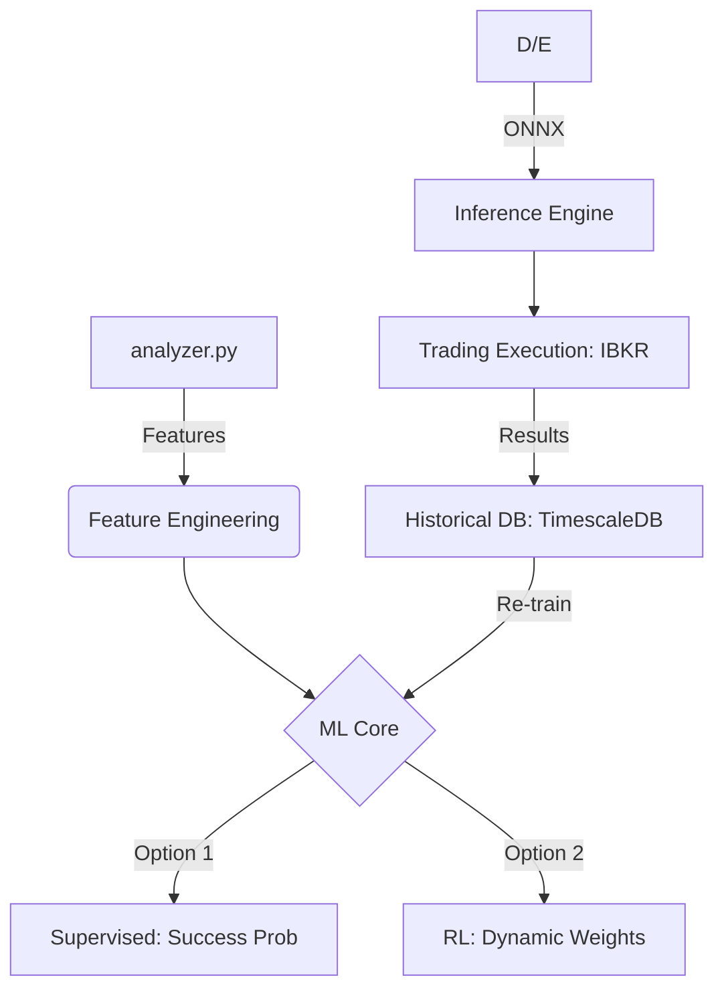

# ButterQuant Deep Learning Implementation Plan

This plan outlines the integration of Machine Learning (ML) and Reinforcement Learning (RL) into the ButterQuant ecosystem to optimize strategy performance through dynamic weighting and predictive signaling.

## 🏗️ Structural Overview

The core objective is to move from a **Static Rule-Based System** to a **Dynamic Adaptive System**.

---

## 📅 Roadmap to Intelligence

### Phase 1: Data Infrastructure (Current Week)
*   **Database Migration**: [COMPLETED] Move from SQLite to PostgreSQL + TimescaleDB for high-volume time-series data.
*   **Labeling Registry**: Implement a `LEAD` based labeling system to track the actual 7-day performance of every "Butterfly Opportunity".
*   **Feature Registry**: Standardize feature extraction from `analyzer.py` (Greeks, GARCH, Fourier).

### Phase 2: Learning & Optimization (Week 2-4)
*   **Target A: Success Probability**: Train a classifier (XGBoost/MLP) to filter opportunities based on predicted success.
*   **Target B: Weight Tuning (RL)**: Implement a DQN Agent to optimize the 4 weights in `calculate_strategy_score`:
    *   w1: Price Match (ARIMA)
    *   w2: Vol Mispricing (GARCH)
    *   w3: Stability (Statistical)
    *   w4: Fourier Align (Cycles)

### Phase 3: Live "Battle" (Month 2+)
*   **Dual Account Implementation (Software-Level)**:
    *   **Architecture**: Instead of two physical broker accounts, we use a single IBKR Paper Trading account.
    *   **Separation**:
        *   **Account A (Baseline)**: Static weights `[35, 30, 20, 15]`. Orders tagged with `orderRef='ButterA'`.
        *   **Account B (RL)**: RL-predicted weights. Orders tagged with `orderRef='ButterB'`.
    *   **Tracking**: Performance is tracked independently in the database based on the `orderRef`.
*   **Metrics**: Compare Sharpe Ratio, Max Drawdown, and Win Rate between the two logic identifiers.

---

## 🛠️ Proposed Changes

### [Backend]
#### [NEW] [ml_feature_extractor.py](file:///c:/Users/okuninushi/Downloads/butterquantdltest/backend/ml_feature_extractor.py)
A central utility to convert `analyzer.py` results into normalized tensors for model input.

#### [NEW] [ml_inference.py](file:///c:/Users/okuninushi/Downloads/butterquantdltest/backend/ml_inference.py)
Integration of ONNX Runtime to provide real-time ML scores to the Flask API.

#### [MODIFY] [analyzer.py](file:///c:/Users/okuninushi/Downloads/butterquantdltest/backend/analyzer.py)
Inject RL weights into `calculate_strategy_score` when `USE_RL=True`.

### [Trading]
#### [NEW] [ibkr_executor.py](file:///c:/Users/okuninushi/Downloads/butterquantdltest/trading/ibkr_executor.py)
Automated order placement and portfolio monitoring using `ib_insync`.

---

## 🧪 Verification Plan

### Evaluation Metrics
*   **Accuracy**: Percent of opportunities that actually landed in the "Butterfly Zone" vs predicted.
*   **Sharpe Improvement**: Comparison of Reward/Risk ratio between Baseline and RL accounts.

### Automated Tests
*   **Backtest Suite**: Run historical data through the RL weights to see if it would have outperformed static weights over the last 180 days.
